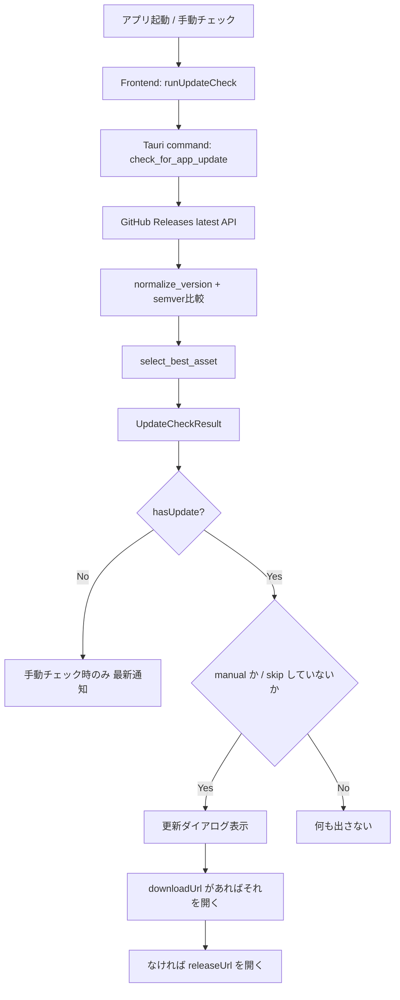

# 【Tauri実践】No.1 Markdown Editor の自動アップデート設計: Rust で最適な配布ファイルを選び、Frontend で更新体験を完成させる

**先に結論**

デスクトップアプリのアップデートで本当に重要なのは、単に「最新バージョンがある」と知らせることではありません。**いまの OS / CPU にとって最適な配布ファイルを、迷わせずに提示すること**です。

`No.1 Markdown Editor` では、この責務を Rust 側に寄せています。`GitHub Releases` から最新リリースを取得し、`semver` で正しく比較し、さらに assets の中から **その環境で最も自然な 1 本** を選びます。Frontend 側は、`いつ確認するか`、`どう見せるか`、`ユーザーの判断をどう記憶するか` に集中します。

この記事では、この分担がかなり効く、という話をします。

## この記事で分かること

- `Tauri` アプリで GitHub Releases を使った更新確認をどう実装するか
- `semver` で `v0.13.0` のようなタグを安全に比較する方法
- assets から OS / アーキテクチャに最適なファイルを選ぶロジック
- Frontend で `24時間の起動時クールダウン` と `skip version` をどう扱うか
- 最適 asset が見つからないときに Release ページへ自然にフォールバックする設計

## 対象読者

- `Tauri` / `Electron` / クロスプラットフォームのデスクトップアプリを開発している方
- 「Windows ユーザーに `.deb` を見せたくない」という当たり前を、ちゃんと実装したい方
- 更新機能を「通信処理」ではなく「UX 設計」として作りたい方

## 全体アーキテクチャ

まず全体像です。



ここで大事なのは、**この実装はアプリ内で自動インストールする仕組みではない**という点です。  
やっていることは、`GitHub Releases` から最新情報を取り、**今の環境に最も合うダウンロード先を選んで開く**ことです。

この割り切り、かなり実践的です。

## 1. Rust 側: 最新リリース取得と `semver` 比較

Rust 側の入口は `check_for_app_update` です。ここで:

- 現在のアプリバージョンを取得
- `GitHub Releases latest API` を呼び出し
- `tag_name` を正規化
- `semver::Version` で比較
- 最適な asset を 1 つ選ぶ

という流れをまとめて処理しています。

ポイントは、**タグ文字列をそのまま比較していない**ことです。  
`v0.13.0` のようなタグを `normalize_version` で `0.13.0` に正規化してから `semver` で比較しています。

```rust
let current_version = normalize_version(&app.package_info().version.to_string())?;
let latest_version = normalize_version(&latest_release.tag_name)?;

let current_semver = Version::parse(&current_version)?;
let latest_semver = Version::parse(&latest_version)?;
```

これで `v` プレフィックスの有無に引きずられず、**セマンティックバージョニングとして正しく newer / older を判定**できます。

## 2. 実装のキモ: `Best Asset Routing`

今回の実装で一番おもしろいのはここです。  
私はこの考え方を **`Best Asset Routing`** と呼んでいます。

やりたいことは単純です。

> Release assets の中から、「この端末に今すぐ出すべき 1 本」を選ぶ

でも、実際は単純ではありません。  
同じリリースに対して `.msi`、`.exe`、`.dmg`、`.AppImage`、`.deb`、`.rpm` が並ぶことは普通ですし、さらに `x64` / `arm64` / `x86` も混ざります。

そこで `select_best_asset` は、各 asset をスコア化して最大値を選びます。

ただしここで重要なのは、**単純な加点合計ではない**ことです。  
実装は `Option<(u8, u8, u8)>` を返していて、実質的には次の優先順位で比較しています。

1. **拡張子の優先順位**
2. **アーキテクチャ一致度**
3. **アーキテクチャ表記のない汎用ファイルをどこまで許容するか**

つまり、**辞書順で比較する 3 段階ランキング**です。

### OS ごとの拡張子優先順位

| OS | 優先順位 |
| --- | --- |
| Windows | `.msi` > `.exe` |
| macOS | `.dmg` |
| Linux | `.AppImage` > `.deb` > `.rpm` |

### アーキテクチャ判定

実装では、ファイル名中のトークンから判定しています。

- `x86_64`, `x64`, `amd64`
- `arm64`, `aarch64`
- `i686`, `ia32`, `x86`

一致したら強く優先され、明示的に別アーキテクチャなら除外されます。

### 他 OS 向け asset の除外

さらに、今の OS ではないと分かる asset は先に落としています。

- Windows では `macos`, `darwin`, `osx`, `linux`, `.deb`, `.rpm`, `appimage` を含むものを除外
- macOS では Windows / Linux 向け token を除外
- Linux では Windows / macOS 向け token を除外

これがあるので、**Windows ユーザーに Linux 用資産を誤提示しにくい**設計になっています。

## 3. 実際の優先ルールをどう読むか

ここは記事でも正確に書いておきたいポイントです。

たとえば Windows + `x86_64` 環境では、だいたい次のような感覚になります。

- `*.msi` は `*.exe` より優先
- 同じ `.msi` 同士なら `x64` 明記が強い
- `arm64` や `x86` 明記のものは落とす
- 明記がない generic asset は fallback として使える

つまり、

- `No1MarkdownEditor_0.13.0_x64.msi`
- `No1MarkdownEditor_0.13.0_x64.exe`
- `No1MarkdownEditor_0.13.0_arm64.exe`

が並んでいたら、選ばれるのは `x64.msi` です。

同様に Linux なら、

- `.AppImage`
- `.deb`
- `.rpm`

の順で優先されます。

このロジックは `src-tauri/src/update.rs` のテストでも押さえられていて、

- Windows は `x64.msi` を優先
- macOS は `.dmg` を優先
- Linux は `.AppImage > .deb > .rpm`
- 不適切なアーキテクチャは除外
- 選べるものがなければ `None`

という期待値がユニットテスト化されています。

## 4. Frontend 側: 「24時間ごとに」ではなく「起動時に、24時間以上空いていたら」

ここは誤解されやすいので、記事では明確に書くのがおすすめです。

この実装は **常駐タイマーで 24 時間おきに裏でチェックする** 方式ではありません。  
実際には `App.tsx` で起動時に `maybeRunAutomaticUpdateCheck()` を呼び、そこで `lastCheckedAt` を見て判定しています。

つまり挙動は:

- アプリ起動時に自動更新チェックを試みる
- ただし前回成功チェックから 24 時間未満なら何もしない
- 自動チェックを無効化していたら何もしない

です。

この設計の良いところは、**シンプルで壊れにくい**ことです。  
常駐タイマーやバックグラウンドジョブを持ち込まないので、実装負荷もデバッグコストも上がりません。

さらに細かいですが、`lastCheckedAt` が更新されるのは **更新確認に成功したときだけ** です。  
通信失敗時にまでクールダウンを開始しないので、次回起動時に素直に再試行できます。

しかも通知の出し方も分けています。

- 手動チェックで最新なら「最新版です」を出す
- 手動チェックで失敗したらエラーを出す
- 自動チェックで失敗したらユーザーには騒がず、ログに残す

この差分、かなり大事です。  
**自動処理は静かに、ユーザーが明示的に押した操作には明確に返す**。この設計は UX 的にとても素直です。

## 5. `skipVersion` が UX をかなり改善する

Frontend 側では `Zustand` の store に以下を永続化しています。

- `autoCheckEnabled`
- `lastCheckedAt`
- `skippedVersion`

特に効いているのが `skippedVersion` です。

動きはこうです。

- 自動チェック時は、`skippedVersion` と同じバージョンならダイアログを出さない
- 手動チェック時は、たとえ skip 済みでも結果を見せる
- 最新版が変わったら `skippedVersion` をクリアする

これ、かなり大事です。

「今はまだ上げたくない」というユーザー判断を尊重しつつ、  
「自分でチェックしたときはちゃんと見せる」ので、コントロール感を失いません。

## 6. Release Notes の見せ方もプロダクト品質

更新ダイアログでは、単に「新しいです」だけでは終わっていません。

- 現在バージョン
- 最新バージョン
- 公開日
- Release Notes
- 選ばれた asset 名

をまとめて表示します。

しかも `release_notes` はそのまま生 Markdown を出すのではなく、Frontend 側で `normalizeReleaseNotes()` を通しています。

- リンク記法をテキスト化
- 見出しの `#` を除去
- 箇条書きを整形
- blockquote や code fence を簡易的に除去

ここも地味ですが効きます。  
**Release 情報を「読めるテキスト」にしてから出す**だけで、更新ダイアログの完成度がかなり上がります。

## 7. 最適 asset が見つからないときは、無理せず Release ページへ

この実装の好きなところがもう 1 つあります。

もし `select_best_asset` が `None` を返しても、それで詰みません。  
Frontend 側では `downloadUrl ?? releaseUrl` という形でフォールバックします。

つまり:

- 最適 asset が見つかれば、そのダウンロード URL を開く
- 見つからなければ、リリースページを開く

です。

これはすごく実務的です。  
「全部自動でやり切る」ことよりも、**失敗時にユーザーを行き止まりにしない**ことを優先しています。

## 8. この記事の要点を 3 行でまとめると

1. 更新機能の本体は「バージョン比較」ではなく **asset の正しいルーティング** です。
2. Rust 側で `OS / arch / packaging` を判断し、Frontend 側で `タイミング / 表示 / 記憶` を担うと責務分離がきれいです。
3. `skipVersion` と `releaseUrl fallback` を入れると、単なる更新機能が一気にプロダクト品質になります。

## 今すぐやるべき action

もし自分のアプリに更新機能を入れるなら、まずはこの 4 点をやるのがおすすめです。

1. `semver` で比較し、`v` 付きタグも正規化する
2. assets 選定を UI 層ではなくコア層に寄せる
3. 自動チェックは `起動時 + 24時間クールダウン` にする
4. `skipVersion` と `releaseUrl` フォールバックを必ず入れる

この 4 点だけでも、更新体験はかなり変わります。

最高です。

## 参考実装

- Rust: `src-tauri/src/update.rs`
- Frontend: `src/lib/update.ts`
- Frontend actions: `src/lib/updateActions.ts`
- Store: `src/store/update.ts`
- UI: `src/components/Updates/UpdateAvailableDialog.tsx`
- Tests: `tests/update-store.test.ts`, `tests/update-ui-wiring.test.ts`
