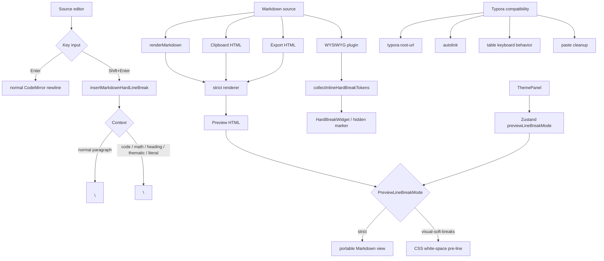

# No.1 Markdown Editor の Line Break / Typora Compatibility を解説する: strict Markdown semantics と書きやすい Preview を両立する

## 先に結論

`No.1 Markdown Editor` の Line Break / Typora Compatibility は、単に `remark-breaks` を入れて「改行を全部 `<br>` にする」機能ではありません。

ここがかなり大事です。

**Markdown file の意味は CommonMark / GFM に近い strict semantics のまま保ち、編集操作と Preview 表示だけを Typora 風に寄せています。**

たとえば Markdown に次のような内容があるとします。

````md
Line 1
Line 2

Line 1<br />
Line 2

Line 1\
Line 2

Line 1  
Line 2
````

この document では、改行の意味がそれぞれ違います。

| Markdown source | strict semantics | writing preview |
| --- | --- | --- |
| `Line 1\nLine 2` | soft break。1 つの paragraph | 視覚的には改行表示できる |
| blank line | paragraph boundary | paragraph boundary |
| `<br />` | hard break | visible line break |
| backslash newline | hard break | visible line break |
| two trailing spaces | hard break | visible line break |

つまり、この実装の基本方針はこうです。

```txt
single newline は soft break のまま
hard break は明示的な syntax だけ
Shift+Enter は canonical hard break を挿入する
Preview は visual-soft-breaks を選べる
Export / Clipboard は strict semantics を使う
Typora 互換は source を壊さない範囲で実現する
```

この記事では、この Line Break / Typora Compatibility 実装をコードで分解します。

## この記事で分かること

- soft break と hard break をどう分けているのか
- なぜ `remark-breaks` 的に single newline を `<br>` にしないのか
- `Shift+Enter` が `"<br />\n"` を挿入する理由
- code block / math block / heading / thematic break では plain newline に戻す理由
- Preview の `visual-soft-breaks` と `strict` mode の違い
- visual soft break が Export / Clipboard / Markdown rendering に漏れない仕組み
- WYSIWYG で `<br>` / backslash / trailing spaces を live preview する方法
- table cell で `Shift+Enter` を inline break として扱う方法
- trailing spaces を invisible character mode で見えるようにする理由
- Typora `typora-root-url`、autolink、paste behavior との互換性
- テストで Line Break / Typora Compatibility の UX contract をどう守っているのか

## 対象読者

- Markdown editor の paragraph / line break 仕様を設計したい方
- Typora 風の書き心地と portable Markdown の両立に悩んでいる方
- Preview では改行して見せたいが、Export では strict にしたい方
- `Shift+Enter`、table cell、WYSIWYG hard break の扱いを実装したい方
- Typora 互換の image root、autolink、paste behavior まで考えたい方

## まず、ユーザー体験

ユーザーから見ると、改行はかなり自然に動きます。

普通に `Enter` を押す。  
同じ paragraph 内で見える改行を入れたいときは `Shift+Enter` を押す。  
Preview では単一改行を見た目上の改行として表示できる。  
でも Export や Clipboard では Markdown の strict semantics が保たれる。

たとえば Source editor で次のように入力します。

```md
Line 1
Line 2
```

これは Markdown semantics では 1 つの paragraph です。

strict Preview では `<br>` になりません。

```html
<p>Line 1 Line 2</p>
```

一方で、writing preview としては次のように見せられます。

```txt
Line 1
Line 2
```

ただし、file は変わりません。

見た目だけです。

明示的に line break を入れたい場合は `Shift+Enter` を使います。

```md
Line 1<br />
Line 2
```

これは Preview、Clipboard、Export、WYSIWYG inline rendering のどこでも hard break として扱います。

```html
<p>Line 1<br>Line 2</p>
```

この「見た目」と「Markdown の意味」を分けることが、この実装の中心です。

## 全体像

ざっくり図にすると、こうなります。



中心になる file は 1 つではありません。

- `extensions.ts`: `Shift+Enter`、hard break insertion、invisible characters
- `markdown.ts`: Preview / Export / Clipboard の strict rendering
- `markdownHtmlRender.ts`: raw HTML を含む Markdown rendering
- `markdownMathRender.ts`: math を含む Markdown rendering
- `markdownMathHtmlRender.ts`: math + raw HTML rendering
- `markdownWorker.ts`: worker rendering
- `markdownShared.ts`: front matter、sanitize schema、standalone HTML
- `markdownHtml.ts`: raw HTML / `<br>` detection
- `ThemePanel.tsx`: Preview line break mode UI
- `MarkdownPreview.tsx`: Preview line break mode class binding
- `global.css`: `visual-soft-breaks` の CSS
- `editor.ts`: `previewLineBreakMode` の persisted store
- `wysiwygHardBreak.ts`: WYSIWYG hard break token detection
- `wysiwyg.ts`: HardBreakWidget、table input key handling
- `wysiwygInlineMarkdown.ts`: inline Markdown rendering
- `wysiwygTable.ts`: table cell line break encode / decode
- `clipboardHtml.ts`: rich clipboard / plain-text clipboard HTML
- `previewClipboard.ts`: Preview selection copy
- `imageRoots.ts` / `renderedImageSources.ts`: Typora `typora-root-url`
- `pasteHtml.ts`: Typora-style paste cleanup

Line Break は小さい機能に見えます。

しかし実際には、editor input、Markdown parser、Preview CSS、Clipboard、Export、WYSIWYG、table、Typora compatibility が全部関係します。

## 1. まず file semantics / editing / preview を分ける

この実装で最初に決めているのは、責務の分離です。

```txt
File semantics:
  saved Markdown の意味

Editing interaction:
  Enter / Shift+Enter / table navigation

Preview rendering:
  ユーザーにどう見せるか
```

同じ「改行」でも、この 3 つを混ぜると壊れます。

たとえば、Preview で単一改行を見た目上の改行にしたいからといって、Markdown parser 側で single newline を全部 `<br>` にすると、Export や Clipboard まで変わってしまいます。

この editor では、その変化を避けます。

```txt
Markdown source:
  strict semantics

Writing Preview:
  見た目だけ Typora 風にできる

Export / Clipboard:
  strict semantics
```

## 2. soft break と hard break を明確に定義する

この実装では、soft break と hard break を分けます。

```txt
soft break:
  paragraph 内の single newline

hard break:
  paragraph 内の visible line break
```

soft break はこうです。

```md
Line 1
Line 2
```

これは strict rendering では 1 paragraph です。

hard break はこうです。

```md
Line 1<br />
Line 2
```

またはこうです。

```md
Line 1\
Line 2
```

または、Markdown の古典的な two trailing spaces です。

```md
Line 1··
Line 2
```

この記事では `··` を trailing spaces の説明として使っています。

実際の file には半角 space が入ります。

## 3. single newline は strict renderer では `<br>` にしない

`renderMarkdown()` は、single newline を `<br>` にしません。

test でも固定しています。

```ts
const html = await renderMarkdown('Line 1\nLine 2\nLine 3')

assert.equal(countRenderedBreaks(html), 0)
assert.equal(countRenderedParagraphs(html), 1)
assert.match(html, /<p>Line 1\s*Line 2\s*Line 3<\/p>/)
```

ここが重要です。

`remark-breaks` のような変換を入れると、single newline がすべて hard break になります。

しかし Markdown file としては、single newline は soft break です。

この editor では file semantics を変えません。

## 4. blank line は paragraph boundary にする

paragraph は blank line で分かれます。

```md
A

B
```

rendering は 2 paragraphs です。

```ts
const html = await renderMarkdown('A\n\n\nB\n')

assert.equal(countRenderedBreaks(html), 0)
assert.equal(countRenderedParagraphs(html), 2)
```

複数の空行があっても、それは「大量の空 paragraph」ではありません。

Markdown document としては paragraph boundary です。

この挙動も Preview、Clipboard、Export の土台になります。

## 5. hard break は明示 syntax だけを認める

hard break は明示的な syntax だけです。

```ts
const markdownHardBreakHtml = await renderMarkdown('Line 1  \nLine 2')
const markdownBackslashBreakHtml = await renderMarkdown('Line 1\\\nLine 2')
const htmlHardBreakHtml = await renderMarkdown('Line 1<br />\nLine 2')
```

test では、どれも `<br>` になることを確認しています。

```ts
assert.match(markdownHardBreakHtml, /<p>Line 1<br\s*\/?>\s*Line 2<\/p>/)
assert.match(markdownBackslashBreakHtml, /<p>Line 1<br\s*\/?>\s*Line 2<\/p>/)
assert.match(htmlHardBreakHtml, /<p>Line 1<br\s*\/?>\s*Line 2<\/p>/)
```

accepted syntax は次の 4 つです。

```txt
two trailing spaces
backslash newline
<br>
<br />
```

## 6. raw HTML detection は `<br>` を見逃さない

Markdown に raw HTML がある場合は、別 renderer path に入ります。

`<br>` も raw HTML として検出します。

```ts
const RAW_HTML_BREAK_PATTERN = /<br\s*\/?>/i

export function containsLikelyRawHtml(markdown: string): boolean {
  if (!markdown) return false
  return RAW_HTML_BREAK_PATTERN.test(markdown) || RAW_HTML_PATTERN.test(markdown)
}
```

`<br />` は hard break として重要です。

raw HTML detection が `<br>` を見落とすと、renderer path によって line break behavior がズレます。

そのため、専用 pattern を持っています。

## 7. rendering path が分かれても semantics は揃える

Markdown rendering は document 内容に応じて path が分かれます。

```ts
const { body } = stripFrontMatter(markdown)
const hasMath = containsLikelyMath(body)
const hasRawHtml = containsLikelyRawHtml(body)
```

math なし / raw HTML なしなら base renderer。

```ts
return renderBaseMarkdown(markdown, syntaxHighlightEngine)
```

raw HTML があれば HTML renderer。

```ts
const { renderMarkdownWithHtml } = await htmlRendererPromise
return renderMarkdownWithHtml(markdown, syntaxHighlightEngine)
```

math があれば math renderer。

```ts
const { renderMarkdownWithMath } = await mathRendererPromise
return renderMarkdownWithMath(markdown, syntaxHighlightEngine)
```

math と raw HTML が両方あれば combined renderer。

```ts
const { renderMarkdownWithMathAndHtml } = await mathHtmlRendererPromise
return renderMarkdownWithMathAndHtml(markdown, syntaxHighlightEngine)
```

path は分かれても、single newline は soft のままです。

test では raw HTML や math がある場合も確認しています。

```ts
assert.equal(countRenderedBreaks(html), 0)
assert.equal(countRenderedParagraphs(html), 1)
```

## 8. worker renderer でも同じ semantics を守る

大きな document では worker rendering を使うことがあります。

worker 側も same contract です。

```ts
const html = await renderMarkdownInWorker('Worker 1\nWorker 2\nWorker 3')

assert.equal(countRenderedBreaks(html), 0)
assert.equal(countRenderedParagraphs(html), 1)
```

Preview の main thread path と worker path で newline semantics が違うと、document size や rendering route によって見た目が変わります。

それは editor としてかなり悪い体験です。

だから worker でも strict semantics を固定しています。

## 9. `Shift+Enter` は canonical hard break を挿入する

Source editor では、`Shift+Enter` を hard line break command に割り当てています。

```ts
keymap.of([
  {
    key: 'Shift-Enter',
    run: insertMarkdownHardLineBreak,
  },
  ...sourceEditorDefaultKeymap,
])
```

canonical insertion はこれです。

```ts
export const MARKDOWN_HARD_LINE_BREAK = '<br />\n'
```

つまり、normal paragraph で `Shift+Enter` を押すとこうなります。

```md
Line 1<br />
Line 2
```

理由は明確です。

```txt
<br />:
  source 上で見える
  trailing whitespace cleanup に壊されにくい
  Clipboard / Export / WYSIWYG で扱いやすい
  HTML paste との round-trip も分かりやすい
```

two trailing spaces も Markdown として有効ですが、見えにくく、formatter や editor 設定で消えやすいです。

この editor では、挿入時の canonical form として `<br />` を選んでいます。

## 10. `Shift+Enter` は文脈によって plain newline に戻す

ただし、どこでも `<br />` を入れるわけではありません。

```ts
const insert = isPositionInsideTextRanges(range.from, literalBlocks) ||
  shouldInsertPlainLineBreakInLine(view.state.doc, line, range.from - line.from)
  ? MARKDOWN_PLAIN_LINE_BREAK
  : MARKDOWN_HARD_LINE_BREAK
```

literal block では plain newline に戻します。

```ts
const fencedCodeBlocks = collectFencedCodeBlocks(markdown)
return [...fencedCodeBlocks, ...collectMathBlocks(markdown, fencedCodeBlocks)]
```

たとえば fenced code block で `Shift+Enter` を押すと、code content に普通の newline が入ります。

````md
```ts
const answer
 = 42
```
````

code block 内で `<br />` が挿入されると、code として壊れます。

だから literal block では plain newline です。

## 11. inline code / inline math / footnote でも plain newline に戻す

line 内の literal token でも `<br />` は入れません。

```ts
const inlineCodeRanges = collectInlineCodeRanges(line.text)
if (findContainingTextRange(lineOffset, inlineCodeRanges)) return true

if (findInlineMathRanges(line.text).some((range) => lineOffset >= range.from && lineOffset < range.to)) {
  return true
}
```

footnote reference / definition の token 内も同じです。

```ts
if (findInlineFootnoteRanges(line.text, inlineCodeRanges).some((range) => lineOffset >= range.from && lineOffset < range.to)) {
  return true
}
```

test では次の case を見ています。

```ts
const cases = [
  { doc: 'Use `inline` token', anchor: 'Use `'.length },
  { doc: 'Inline $E=mc^2$ example', anchor: 'Inline $'.length },
  { doc: 'Text with [^note] ref', anchor: 'Text with [^'.length },
  { doc: '[^note]: definition', anchor: '[^'.length },
]
```

`Shift+Enter` は便利ですが、Markdown token を壊してはいけません。

## 12. heading / thematic break でも plain newline に戻す

heading line や thematic break line でも `<br />` は入れません。

```ts
if (ATX_HEADING_PATTERN.test(line.text) || isThematicBreakLine(line.text) || isSetextHeadingUnderlineLine(line.text)) {
  return true
}
```

setext heading の underline も扱います。

```ts
const SETEXT_HEADING_UNDERLINE_PATTERN = /^[ ]{0,3}(?:=+|-+)[ \t]*$/
```

test case はこうです。

```ts
const cases = [
  { doc: '# Heading', anchor: '# He'.length },
  { doc: ['Title', '-----'].join('\n'), anchor: 'Tit'.length },
  { doc: ['Title', '====='].join('\n'), anchor: 'Tit'.length },
  { doc: '---', anchor: 1 },
]
```

heading や thematic break は block syntax です。

そこに inline hard break を挿入すると、意図しない Markdown になりやすいです。

## 13. multi-cursor でも context-aware に動く

CodeMirror では複数 selection があり得ます。

`insertMarkdownHardLineBreak()` は `changeByRange()` を使います。

```ts
view.dispatch({
  ...view.state.changeByRange((range) => {
    const line = view.state.doc.lineAt(range.from)
    const insert = // context-aware
    return {
      changes: { from: range.from, to: range.to, insert },
      range: EditorSelection.cursor(range.from + insert.length),
    }
  }),
})
```

つまり、同じ `Shift+Enter` でも selection ごとに判断します。

```txt
plain paragraph:
  <br />\n

inline code:
  \n

fenced code:
  \n
```

multi-cursor editing でも、1 つの大雑把な rule を全 selection に押し付けません。

## 14. Preview line break mode は Zustand store にある

Preview の表示 mode は store にあります。

```ts
export type PreviewLineBreakMode = 'strict' | 'visual-soft-breaks'
```

初期値は writing preview 向けの `visual-soft-breaks` です。

```ts
previewLineBreakMode: 'visual-soft-breaks',
setPreviewLineBreakMode: (previewLineBreakMode) => set({
  previewLineBreakMode,
  hasExplicitPreviewLineBreakModePreference: true,
})
```

ここで重要なのは、これは Preview 表示設定だということです。

Markdown parser の設定ではありません。

```txt
previewLineBreakMode:
  Preview DOM に class を付ける設定

Markdown source:
  変えない

Export / Clipboard:
  変えない
```

## 15. invalid persisted value は sanitize する

persisted store から戻すときは、値を sanitize します。

```ts
function sanitizePreviewLineBreakMode(value: unknown): PreviewLineBreakMode {
  return value === 'strict' ? value : 'visual-soft-breaks'
}
```

merge では、明示的に preference を持っているかも見ます。

```ts
previewLineBreakMode:
  persistedState?.hasExplicitPreviewLineBreakModePreference
    ? sanitizePreviewLineBreakMode(persistedState?.previewLineBreakMode)
    : 'visual-soft-breaks',
```

古い persisted state や不正な値があっても、Preview mode が壊れないようにしています。

表示設定は UX の一部ですが、壊れた localStorage に引きずられて editor が不安定になるべきではありません。

## 16. ThemePanel から Preview line break mode を切り替える

ThemePanel には Preview line break の toggle があります。

```tsx
{([
  { mode: 'visual-soft-breaks', label: t('themePanel.previewLineBreakModes.visualSoftBreaks') },
  { mode: 'strict', label: t('themePanel.previewLineBreakModes.strict') },
] as const).map(({ mode, label }) => (
  <button
    key={mode}
    type="button"
    onClick={() => setPreviewLineBreakMode(mode)}
  >
    {label}
  </button>
))}
```

日本語 locale ではこうです。

```json
{
  "previewLineBreaks": "プレビュー改行表示",
  "previewLineBreakModes": {
    "strict": "厳密",
    "visualSoftBreaks": "ソフト改行を表示"
  }
}
```

hint も分けています。

```json
{
  "previewLineBreakHintStrict": "互換モードです。可搬性の高い Markdown の意味を優先し、単一改行は同じ段落内に留まります。",
  "previewLineBreakHintVisualSoftBreaks": "標準の執筆プレビューです。単一改行を視覚的な改行として表示しますが、ファイル内容は変えません。"
}
```

ここでも、「見た目は変えるが file は変えない」ことを UI copy に出しています。

## 17. Preview は class だけを切り替える

Preview component は store の値を読みます。

```tsx
const previewLineBreakMode = useEditorStore((state) => state.previewLineBreakMode)
```

そして class を付けます。

```tsx
className={`markdown-preview animate-in${previewLineBreakMode === 'visual-soft-breaks' ? ' markdown-preview--visual-soft-breaks' : ''}`}
```

Markdown renderer に option を渡していません。

ここが大事です。

```txt
strict:
  normal markdown-preview

visual-soft-breaks:
  markdown-preview markdown-preview--visual-soft-breaks
```

つまり、Preview line break mode は CSS layer の責務です。

## 18. visual soft break は CSS `white-space: pre-line` で実現する

visual soft break は CSS で実現します。

```css
.markdown-preview--visual-soft-breaks :is(p, td, th) {
  white-space: pre-line;
}
```

`pre-line` は newline を表示上の line break として扱います。

ただし、Markdown source は変わりません。

```txt
source:
  Line 1\nLine 2

strict HTML:
  <p>Line 1\nLine 2</p>

visual CSS:
  white-space: pre-line
```

この方法なら、Preview だけを Typora 風にできます。

## 19. loose list では `li` 全体に `pre-line` を当てない

list は少し厄介です。

loose list は `<li>` の中に `<p>` や nested list を持ちます。

`li` 全体に `white-space: pre-line` を当てると、formatter whitespace が visible gap になります。

そのため、tight list だけに限定しています。

```css
.markdown-preview--visual-soft-breaks li:not(:has(> :is(p, ul, ol, pre, blockquote, details, table, hr, img, h1, h2, h3, h4, h5, h6, div, section, .front-matter))) {
  white-space: pre-line;
}
```

test でも、loose list wrapper が visible blank line にならないことを確認しています。

```ts
assert.match(
  html,
  /<li>\s*<p><a href="#overview">Overview<\/a><\/p>\s*<\/li>\s*<li>\s*<p>Block Elements<\/p>\s*<ul>/u
)
```

Preview の見た目を良くするための設定が、list layout を壊してはいけません。

## 20. visual soft break は Export / Clipboard に漏らさない

Preview line break mode は、Markdown rendering、Clipboard、Export には出しません。

test では source file を直接見ています。

```ts
for (const source of [markdownSource, clipboardSource, exportSource]) {
  assert.doesNotMatch(source, /previewLineBreakMode/u)
  assert.doesNotMatch(source, /visual-soft-breaks/u)
}
```

これはかなり重要な UX contract です。

```txt
Preview:
  visual-soft-breaks を使える

Rich Clipboard:
  strict Markdown rendering

HTML / PDF Export:
  strict Markdown rendering

Saved Markdown:
  変更なし
```

「見た目の好み」が document artifact に漏れると、Markdown editor として信頼できなくなります。

## 21. Clipboard rich HTML は strict renderer を使う

Rich clipboard は `renderMarkdown()` を通ります。

```ts
export async function renderClipboardHtmlFromMarkdown(
  markdown: string,
  mermaidTheme: 'default' | 'dark' = 'default'
): Promise<string> {
  const { renderMarkdown } = await import('./markdown.ts')

  let bodyHtml = await renderMarkdown(markdown)
  // Mermaid rendering
  return bodyHtml
}
```

つまり、Clipboard HTML は Preview の `visual-soft-breaks` class ではなく、strict Markdown rendering の HTML です。

hard break は `<br>` になります。

soft break は `<br>` になりません。

```ts
assert.doesNotMatch(clipboard.html, /<br\s*\/?>/)
assert.match(clipboard.html, /<p>Line 1\s*Line 2<\/p>/)
```

Clipboard は別の editor や CMS に渡す data なので、表示 preference ではなく Markdown semantics を優先します。

## 22. Plain text fallback は paragraph と line break を見やすくする

Source editor copy などの Markdown-safe clipboard では、plain text を HTML escape して fallback HTML を作ります。

```ts
export function buildPlainTextClipboardHtml(text: string): string {
  return normalizeClipboardPlainText(text)
    .split(/\n{2,}/)
    .map((paragraph) => `<p>${escapeHtml(paragraph).replace(/\n/g, '<br />')}</p>`)
    .join('')
}
```

これは Markdown rendering ではありません。

source text を rich editor に貼ったとき、selection の line break が潰れないようにする fallback です。

```txt
Source copy:
  Markdown source をコピーする

Rich HTML fallback:
  source text を escaped paragraph として表現する
```

Copy Rich HTML とは意味が違います。

## 23. Export HTML も strict semantics を使う

Export HTML / PDF も `renderMarkdown()` から作ります。

```ts
let bodyHtml = await renderMarkdown(markdown)
```

Preview の `visual-soft-breaks` mode は export path に入りません。

line break integration test では、Export wrapper でも hard break が `<br>` になることを確認しています。

```ts
const standaloneHtml = buildStandaloneHtml('Doc', previewHtml)

assert.match(standaloneHtml, /<p>Line 1<br\s*\/?>\s*Line 2<\/p>/)
```

逆に soft break は `<br>` になりません。

```ts
assert.doesNotMatch(standaloneHtml, /<br\s*\/?>/)
```

Export は document artifact です。

writing preview の好みより、portable Markdown semantics を優先します。

## 24. WYSIWYG は hard break syntax を live preview する

WYSIWYG mode では、cursor が離れた line の hard break syntax を Preview 風にします。

その中心は `collectInlineHardBreakTokens()` です。

```ts
export function collectInlineHardBreakTokens(
  text: string,
  excludedRanges: readonly TextRange[] = [],
  options: { hasFollowingLine?: boolean } = {}
): InlineHardBreakToken[] {
  // <br>, backslash, trailing spaces
}
```

HTML hard break は pattern で拾います。

```ts
const INLINE_HTML_HARD_BREAK_PATTERN = /<br\s*\/?>/giu
```

trailing spaces も hard break token として扱います。

```ts
const TRAILING_SPACE_HARD_BREAK_PATTERN = / {2,}$/u
```

WYSIWYG は source を変えず、見た目だけ hard break として扱います。

## 25. WYSIWYG hard break は literal range を避ける

hard break syntax が code span の中にある場合、それは syntax ではなく literal text です。

そのため excluded ranges を見ます。

```ts
if (rangeIntersectsTextRanges(from, to, excludedRanges)) continue
```

test では、inline code 内の `<br />`、backslash、trailing spaces を無視することを確認しています。

```ts
assert.deepEqual(
  collectInlineHardBreakTokens('`<br />`', [{ from: 0, to: htmlBreak.length }]),
  []
)
```

WYSIWYG の live preview では、Markdown syntax と literal text を混同しないことが重要です。

## 26. HardBreakWidget は `<br>` を DOM に置く

WYSIWYG で hard break を表示するときは widget を使います。

```ts
class HardBreakWidget extends WidgetType {
  toDOM() {
    const el = document.createElement('br')
    el.className = 'cm-wysiwyg-hard-break'
    el.setAttribute('aria-hidden', 'true')
    return el
  }

  ignoreEvent() { return true }
}
```

`processInlineHardBreaks()` は token に応じて replacement を変えます。

```ts
const replacement = token.renderWidget
  ? Decoration.replace({ widget: new HardBreakWidget() })
  : Decoration.replace({})
```

同じ line の中に `<br />` がある場合は widget を置きます。

line 末尾の hard break syntax で次の line がある場合は、source marker を隠すだけで、実際の line boundary が visible break になります。

## 27. terminal hard break の扱いも分ける

`<br />` が line 末尾にあり、次の line がある場合は、marker を隠せば十分です。

```ts
renderWidget: to !== text.length || !hasFollowingLine
```

考え方はこうです。

```txt
Line 1<br />
Line 2

WYSIWYG:
  <br /> marker は隠す
  CodeMirror の次 line が visible break になる
```

一方で、document 最後の line に `<br />` がある場合は、次の line がありません。

そのときは widget として `<br>` を置きます。

terminal literal を壊さないための細かい分岐です。

## 28. WYSIWYG task checkbox は `Shift+Enter` を奪わない

Task checkbox widget は keyboard 操作できます。

ただし、toggle は plain `Enter` / `Space` だけです。

```ts
function isPlainTaskCheckboxToggleKey(event: KeyboardEvent): boolean {
  return (
    !event.altKey &&
    !event.ctrlKey &&
    !event.metaKey &&
    !event.shiftKey &&
    (event.key === ' ' || event.key === 'Enter')
  )
}
```

`Shift+Enter` を checkbox が consume すると、line break 操作ができなくなります。

WYSIWYG widget は便利ですが、editor の基本 shortcut を奪ってはいけません。

## 29. table cell では `Shift+Enter` が inline break になる

WYSIWYG table cell は textarea で編集します。

table cell 内では `Shift+Enter` を inline break として扱います。

```ts
if (event.key !== 'Enter' || event.metaKey) return null
if (event.shiftKey) return 'shift-enter'
if (event.ctrlKey) return 'ctrl-enter'
return 'enter'
```

table key action ではこうなります。

```ts
case 'shift-enter':
  return { kind: 'insert-inline-break', insertText: '<br />' }
```

つまり、cell 内では次のような Markdown table cell になります。

```md
| Name | Memo |
| --- | --- |
| Alice | line one<br />line two |
```

これは Typora 風の table editing に近い動きです。

## 30. table cell の `<br />` は textarea では newline として見せる

Markdown table cell の source には `<br />` を入れます。

でも textarea で編集するときは newline として見せます。

decode では `<br>` を `\n` にします。

```ts
const markdownTableLineBreakPattern = /^<br\s*\/?\s*>/iu

if (lineBreakMatch) {
  return { displayText: '\n', rawLength: lineBreakMatch[0].length }
}
```

WYSIWYG inline rendering では、table cell の line break を marker にできます。

```ts
const rendered = renderInlineMarkdownFragment(cell.text, {
  tableLineBreakMode: 'placeholder',
})
```

`renderInlineMarkdownFragment()` は `<br>` を marker span に置き換えます。

```ts
return html.replace(
  /<br\s*\/?>/gu,
  '<span class="cm-wysiwyg-table__line-break-marker">&lt;br /&gt;</span>'
)
```

source は Markdown table のまま、editing surface では自然に見せています。

## 31. table navigation も Typora-style に寄せる

table cell では、`Enter`、`Tab`、`Shift+Tab`、`Ctrl+Enter` も専用の意味を持ちます。

test では、Typora-style behavior としてまとめて固定しています。

```ts
assert.deepEqual(resolveTableKeyAction(table, { section: 'body', rowIndex: 0, columnIndex: 1 }, 'shift-enter'), {
  kind: 'insert-inline-break',
  insertText: '<br />',
})
```

`Enter` は下の cell へ移動します。

```ts
assert.deepEqual(resolveTableKeyAction(table, { section: 'head', rowIndex: 0, columnIndex: 1 }, 'enter'), {
  kind: 'focus-cell',
  location: { section: 'body', rowIndex: 0, columnIndex: 1 },
  selectionBehavior: 'end',
})
```

`Tab` は次の cell、`Shift+Tab` は前の cell へ移動します。

Markdown table は raw source だと編集しにくいので、ここは Typora 風の ergonomics を優先しています。

## 32. invisible characters は hard break debugging を助ける

two trailing spaces は Markdown hard break ですが、見えません。

そのため、source editor には invisible character mode があります。

```ts
const trailingSpaceDecorator = createTrailingSpaceDecorator()
const activeLineTrailingSpaceDecorator = createTrailingSpaceDecorator({ activeLineOnly: true })
```

trailing spaces は 1 文字ずつ decoration します。

```ts
for (let pos = from; pos < to; pos += 1) {
  add(pos, pos + 1, trailingSpaceMark)
}
```

CSS では trailing space 用の色を分けています。

```css
--editor-invisible-trailing: color-mix(in srgb, var(--accent) 26%, var(--text-muted));
```

two trailing spaces は source 上で見えにくい hard break syntax なので、debug しやすくする価値があります。

## 33. WYSIWYG では invisible marker を active line に限定する

Invisible character mode は source editor の visual aid です。

WYSIWYG mode では inactive lines を Preview に近く保つ必要があります。

そのため、WYSIWYG では active line だけに marker を出します。

```tsx
buildInvisibleCharacterExtensions(showInvisibleCharacters, { activeLineOnly: wysiwygMode })
```

active line 判定は focus と cursor line を見ます。

```ts
function rangeStartsOnFocusedCursorLine(view: EditorView, from: number): boolean {
  if (!view.hasFocus) return false

  const lineNumber = view.state.doc.lineAt(from).number
  return view.state.selection.ranges.some((range) => {
    const cursorLine = view.state.doc.lineAt(range.head).number
    return lineNumber === cursorLine
  })
}
```

WYSIWYG では「読んでいる場所」は Preview 風に、「編集中の場所」は source の手がかりを出す、という設計です。

## 34. invisible character mode も Export / Clipboard に漏らさない

Invisible character mode は source editor の decoration です。

Markdown rendering や Export / Clipboard には入れません。

test でも確認しています。

```ts
for (const source of [markdownSource, clipboardSource, exportSource, previewSource]) {
  assert.doesNotMatch(source, /showInvisibleCharacters/u)
}
```

line break debugging のための UI が、document artifact に混ざると困ります。

ここでも「見た目」と「source semantics」を分けています。

## 35. Typora `typora-root-url` を image source に反映する

Typora compatibility は line break だけではありません。

Typora 互換 document では front matter に `typora-root-url` が入ることがあります。

```md
---
typora-root-url: https://assets.example.com/posts
---


```

render 後の image source は `rewriteRenderedHtmlImageSources()` で解決します。

```ts
const rootUrl = getFrontMatterValue(options.frontMatter, 'typora-root-url')
const resolvedSource = resolveTyporaRootUrlAsset(source, rootUrl)
```

HTTP root なら URL として解決します。

```ts
if (/^https?:/i.test(root)) {
  const base = root.endsWith('/') ? root : `${root}/`
  return new URL(source, base).toString()
}
```

test では Markdown image と raw HTML image の両方を見ています。

```ts
assert.match(html, /src="https:\/\/assets\.example\.com\/posts\/cover\.png"/)
assert.match(html, /src="http:\/\/cdn\.example\.com\/content\/hero\/banner\.jpg"/)
```

Typora から持ってきた document の asset path が Preview で壊れにくくなります。

## 36. absolute source は `typora-root-url` で上書きしない

`resolveTyporaRootUrlAsset()` は、何でも root に結合するわけではありません。

```ts
if (isExternalSource(source) || isFileUrl(source) || isAbsoluteAssetPath(source)) {
  return source
}
```

たとえば次の source はそのままです。

```txt
http://example.com/hero.png
data:image/png;base64,abc
file:///C:/docs/hero.png
C:\docs\hero.png
```

test でも確認しています。

```ts
assert.equal(resolveTyporaRootUrlAsset('http://example.com/hero.png', 'https://assets.example.com/posts'), 'http://example.com/hero.png')
assert.equal(resolveTyporaRootUrlAsset('data:image/png;base64,abc', 'https://assets.example.com/posts'), 'data:image/png;base64,abc')
```

root URL は relative asset を助けるための設定であり、absolute source を書き換えるためのものではありません。

## 37. GFM autolink / angle autolink を支える

Typora compatibility では、URL や email の扱いも重要です。

renderer は `remarkGfm` を使っています。

```ts
.use(remarkGfm, { singleTilde: false })
```

angle-bracket autolink はこうです。

```md
For example <i@typora.io> and <https://example.com>
```

test では email と URL が link になることを確認しています。

```ts
assert.match(html, /<a href="mailto:i@typora\.io">i@typora\.io<\/a>/)
assert.match(html, /<a href="https:\/\/example\.com">https:\/\/example\.com<\/a>/)
```

GFM autolink literal も扱います。

```md
Contact i@typora.io or www.google.com
```

```ts
assert.match(html, /<a href="mailto:i@typora\.io">i@typora\.io<\/a>/)
assert.match(html, /<a href="http:\/\/www\.google\.com">www\.google\.com<\/a>/)
```

Line break とは別機能に見えますが、Typora からの文書互換ではこうした inline behavior も重要です。

## 38. WYSIWYG inline Markdown でも autolink を揃える

WYSIWYG inline fragment でも同じように autolink を render します。

```ts
const html = renderInlineMarkdownFragment('Contact <i@typora.io> and www.google.com')

assert.match(html, /<a href="mailto:i@typora\.io">i@typora\.io<\/a>/)
assert.match(html, /<a href="http:\/\/www\.google\.com">www\.google\.com<\/a>/)
```

Preview では link になるのに WYSIWYG では plain text になる、というズレは避けたいです。

WYSIWYG は Preview の完全コピーではありませんが、inline Markdown の意味はできるだけ揃えます。

## 39. Paste では Typora-style に decorative anchor を落とす

Web page から HTML を paste すると、heading permalink icon や invisible anchor が混ざります。

`pasteHtml.ts` は、href のない空 anchor を落とします。

```ts
if (tagName === 'a' && !attributes['href']) {
  const hasOnlyWhitespaceChildren = Array.from(element.childNodes).every(
    (child) => child.nodeType === 3 && (child.textContent ?? '').trim() === ''
  )
  if (hasOnlyWhitespaceChildren) return null
}
```

link serialization でも、decorative anchor を落とします。

```ts
if (!content) {
  if (/^#/.test(href) || isDecorativeAnchor(node)) return ''
  return `<${href}>`
}
```

comment にもある通り、Typora の paste behavior に寄せています。

```ts
// Drop decorative/empty anchors ... to match the behavior of editors like Typora.
```

Markdown に不要な UI chrome を持ち込まないための処理です。

## 40. Paste の image alt fallback も Typora-style にする

HTML paste で image に alt がない場合、stable placeholder を使います。

```ts
const alt = escapeMarkdownText(node.attributes?.alt?.trim() || 'img')
return ``
```

comment では Typora-style として明示しています。

```ts
// Typora-style clipboard conversions use a stable placeholder when the source image lacks alt text.
```

これにより、alt なし image でも Markdown image syntax として安定します。

```md

```

空の `` にするより、copy / paste 後の Markdown が扱いやすくなります。

## 41. Qiita-style HTML paste も Typora-style output に近づける

paste converter は、Qiita のような HTML 由来の noise も処理します。

test では、block-descendant author chip の output を固定しています。

```ts
assert.equal(
  markdown,
  [
    '',
    '',
    '@yushibats',
    '',
    'in[日本オラクル株式会社](https://qiita.com/organizations/oracle)',
  ].join('\n')
)
```

これは Line Break から少し離れますが、Typora compatibility の現実的な部分です。

Web から copy したものを Markdown に戻すとき、DOM 構造ではなく「ユーザーが欲しい Markdown」に近づけます。

## 42. Front matter は rendering 前に切り分ける

Typora 互換 document では front matter を持つことがあります。

`stripFrontMatter()` は CRLF も扱います。

```ts
const match = markdown.match(/^---\r?\n([\s\S]*?)\r?\n---(?:\r?\n|$)/)
```

test では CRLF front matter を確認しています。

```ts
const markdown = ['---', 'title: "Hello"', 'lang: en', '---', '', '# Body'].join('\r\n')
const result = stripFrontMatter(markdown)

assert.deepEqual(result.meta, { title: 'Hello', lang: 'en' })
assert.equal(result.body, '# Body')
```

front matter は metadata として HTML に出せますが、body rendering の line break semantics とは分けます。

## 43. sanitize schema は `file` / `data` image source を許可する

Typora compatibility では local image path も重要です。

sanitize schema では image `src` に `data` と `file` を許可しています。

```ts
protocols: {
  ...defaultSchema.protocols,
  src: Array.from(new Set([...(defaultSchema.protocols?.src ?? []), 'data', 'file'])),
}
```

これにより、次のような source を Preview で保持できます。

```txt
data:image/png;base64,...
file:///C:/Users/...
```

Line Break とは直接関係しませんが、Typora 互換 document の Preview を壊さないための基盤です。

## 44. Windows path は renderer 全体で file URL に寄せる

Windows absolute image source は sanitizer 前に file URL にします。

```ts
.use(rehypeNormalizeImageSources)
.use(rehypeSanitize, sanitizeSchema)
```

base renderer、raw HTML renderer、math renderer、worker renderer、WYSIWYG inline renderer で同じ順番を使います。

```txt
normalize:
  C:/Users/... -> file:///C:/Users/...

sanitize:
  file protocol を許可
```

test では math renderer や worker renderer でも確認しています。

```ts
assert.match(html, /src="file:\/\/\/C:\/Users\/thinkpad\/Pictures\/math-hero\.png"/)
assert.match(workerHtml, /src="file:\/\/\/C:\/Users\/thinkpad\/Pictures\/worker-raw\.png"/)
```

Typora から持ってきた local image path が renderer path によって落ちるのを防ぎます。

## 45. テスト: source shortcut を守る

`tests/editor-line-break-shortcut.test.ts` では、`Shift+Enter` の source editor behavior を確認しています。

```ts
assert.equal(insertMarkdownHardLineBreak(view), true)

const expectedDoc = `Line 1${MARKDOWN_HARD_LINE_BREAK}`
assert.equal(nextState.doc.toString(), expectedDoc)
```

keymap wiring も見ています。

```ts
assert.match(source, /key:\s*'Shift-Enter'/)
assert.match(source, /run:\s*insertMarkdownHardLineBreak/)
```

literal block fallback、inline code / math / footnote fallback、heading / thematic fallback、multi-cursor も test しています。

line break は小さな shortcut に見えますが、実際には Markdown syntax を壊さないための分岐が多いです。

## 46. テスト: Preview line break setting を守る

`tests/preview-line-break-settings.test.ts` では、Preview line break mode の contract を守っています。

store の type と初期値。

```ts
assert.match(store, /export type PreviewLineBreakMode = 'strict' \| 'visual-soft-breaks'/)
assert.match(store, /previewLineBreakMode: 'visual-soft-breaks'/)
```

ThemePanel と Preview class binding。

```ts
assert.match(panel, /themePanel\.previewLineBreakModes\.strict/)
assert.match(panel, /themePanel\.previewLineBreakModes\.visualSoftBreaks/)
assert.match(preview, /markdown-preview--visual-soft-breaks/)
```

CSS。

```ts
assert.match(css, /\.markdown-preview--visual-soft-breaks :is\(p, td, th\)\s*\{[\s\S]*white-space:\s*pre-line;/u)
```

そして、Export / Clipboard に漏れないことも確認しています。

```ts
assert.doesNotMatch(source, /visual-soft-breaks/u)
```

## 47. テスト: strict renderer と integration を守る

`tests/markdown-utils.test.ts` では、single newline が soft break のままであることを確認しています。

```ts
assert.equal(countRenderedBreaks(html), 0)
assert.equal(countRenderedParagraphs(html), 1)
```

`tests/line-break-integration.test.ts` では、Preview、Rich Clipboard、Export wrapper、WYSIWYG inline rendering を横断して確認しています。

```ts
assert.match(previewHtml, /<p>Line 1<br\s*\/?>\s*Line 2<\/p>/)
assert.match(clipboard.html, /<p>Line 1<br\s*\/?>\s*Line 2<\/p>/)
assert.match(inlineHtml, /Line 1<br\s*\/?>\s*Line 2/u)
assert.match(standaloneHtml, /<p>Line 1<br\s*\/?>\s*Line 2<\/p>/)
```

soft break では `<br>` が出ないことも確認します。

```ts
assert.doesNotMatch(previewHtml, /<br\s*\/?>/)
assert.doesNotMatch(clipboard.html, /<br\s*\/?>/)
assert.doesNotMatch(standaloneHtml, /<br\s*\/?>/)
assert.doesNotMatch(inlineHtml, /<br\s*\/?>/)
```

## 48. テスト: WYSIWYG hard break を守る

`tests/wysiwyg-line-breaks.test.ts` では、WYSIWYG hard break collector を確認しています。

```ts
assert.deepEqual(
  collectInlineHardBreakTokens('Line 1<br />Line 2'),
  [
    {
      from: inlineHtml.indexOf('<br />'),
      to: inlineHtml.indexOf('<br />') + '<br />'.length,
      renderWidget: true,
    },
  ]
)
```

backslash と trailing spaces も見ます。

```ts
assert.deepEqual(
  collectInlineHardBreakTokens('Line 1\\'),
  [{ from: markdownBackslash.length - 1, to: markdownBackslash.length, renderWidget: false }]
)
```

task checkbox が `Shift+Enter` を奪わないことも wiring test で守っています。

```ts
assert.match(source, /!event\.shiftKey/u)
assert.match(source, /\(event\.key === ' ' \|\| event\.key === 'Enter'\)/u)
```

## 49. テスト: Typora compatibility を守る

Typora compatibility は複数の test に散らばっています。

`typora-root-url`。

```ts
assert.match(html, /src="https:\/\/assets\.example\.com\/posts\/cover\.png"/)
```

autolink。

```ts
assert.match(html, /<a href="mailto:i@typora\.io">i@typora\.io<\/a>/)
assert.match(html, /<a href="http:\/\/www\.google\.com">www\.google\.com<\/a>/)
```

table keyboard behavior。

```ts
assert.deepEqual(resolveTableKeyAction(table, { section: 'body', rowIndex: 0, columnIndex: 1 }, 'shift-enter'), {
  kind: 'insert-inline-break',
  insertText: '<br />',
})
```

paste behavior。

```ts
assert.equal(
  markdown,
  [
    '',
    '',
    '@yushibats',
  ].join('\n')
)
```

Typora compatibility は単一の flag ではありません。

複数の workflow を少しずつ揃える設計です。

## 実装の要点

### 1. Markdown file semantics は strict に保つ

single newline は soft break です。

hard break は `<br>`、backslash newline、two trailing spaces など、明示 syntax だけです。

### 2. Editing interaction は Typora-style に寄せる

Source editor の `Shift+Enter` は canonical hard break として `"<br />\n"` を挿入します。

ただし code、math、inline literal、heading、thematic break では plain newline に戻します。

### 3. Preview は writing comfort を優先できる

Preview line break mode は `strict` と `visual-soft-breaks` を持ちます。

`visual-soft-breaks` は CSS class で見た目だけを変え、Markdown source / Clipboard / Export には漏れません。

### 4. WYSIWYG / table でも hard break contract を守る

WYSIWYG は `<br>` / backslash / trailing spaces を live preview します。

table cell では `Shift+Enter` が `<br />` を挿入し、textarea では newline として編集できます。

### 5. Typora compatibility は周辺 workflow まで含める

`typora-root-url`、GFM autolink、decorative anchor cleanup、image alt fallback、table keyboard behavior などを合わせて、Typora から来た Markdown を壊しにくくしています。

## この記事の要点を 3 行でまとめると

1. Line Break 実装は、single newline を soft break として保つ strict Markdown semantics を土台にしています。
2. `Shift+Enter`、visual soft-break Preview、WYSIWYG hard break、table cell inline break によって、source を壊さず Typora 風の書きやすさを作っています。
3. Export / Clipboard / worker rendering / Typora root / autolink / paste cleanup / tests まで含めて、見た目の便利さと Markdown の可搬性を分離しています。

## 参考実装

- Source editor line break command: `src/components/Editor/extensions.ts`
- Preview line break state: `src/store/editor.ts`
- ThemePanel preview line break UI: `src/components/ThemePanel/ThemePanel.tsx`
- Preview class binding: `src/components/Preview/MarkdownPreview.tsx`
- Visual soft-break CSS: `src/global.css`
- Markdown renderer: `src/lib/markdown.ts`
- Raw HTML detection: `src/lib/markdownHtml.ts`
- Raw HTML renderer: `src/lib/markdownHtmlRender.ts`
- Math renderer: `src/lib/markdownMathRender.ts`
- Math + HTML renderer: `src/lib/markdownMathHtmlRender.ts`
- Worker renderer: `src/lib/markdownWorker.ts`
- Shared Markdown helpers: `src/lib/markdownShared.ts`
- Clipboard HTML helpers: `src/lib/clipboardHtml.ts`
- Preview clipboard helpers: `src/lib/previewClipboard.ts`
- WYSIWYG hard break collector: `src/components/Editor/wysiwygHardBreak.ts`
- WYSIWYG main plugin: `src/components/Editor/wysiwyg.ts`
- WYSIWYG inline renderer: `src/components/Editor/wysiwygInlineMarkdown.ts`
- WYSIWYG table helpers: `src/components/Editor/wysiwygTable.ts`
- Typora root URL image resolution: `src/lib/imageRoots.ts`, `src/lib/renderedImageSources.ts`
- HTML paste converter: `src/lib/pasteHtml.ts`
- Spec: `docs/paragraph-and-line-breaks-spec.md`
- Tests: `tests/editor-line-break-shortcut.test.ts`, `tests/preview-line-break-settings.test.ts`, `tests/line-break-integration.test.ts`, `tests/markdown-utils.test.ts`, `tests/wysiwyg-line-breaks.test.ts`, `tests/wysiwyg-inline-markdown.test.ts`, `tests/wysiwyg-tables.test.ts`, `tests/clipboard-html.test.ts`, `tests/paste-html.test.ts`, `tests/editor-invisible-characters-settings.test.ts`
