## Flowchart

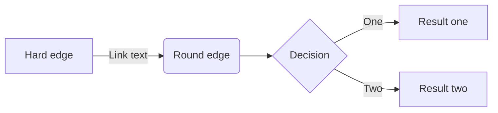
```mermaid
flowchart LR
    A[Hard edge] -->|Link text| B(Round edge)
    B --> C{Decision}
    C -->|One| D[Result one]
    C -->|Two| E[Result two]

```

## Sequence Diagram

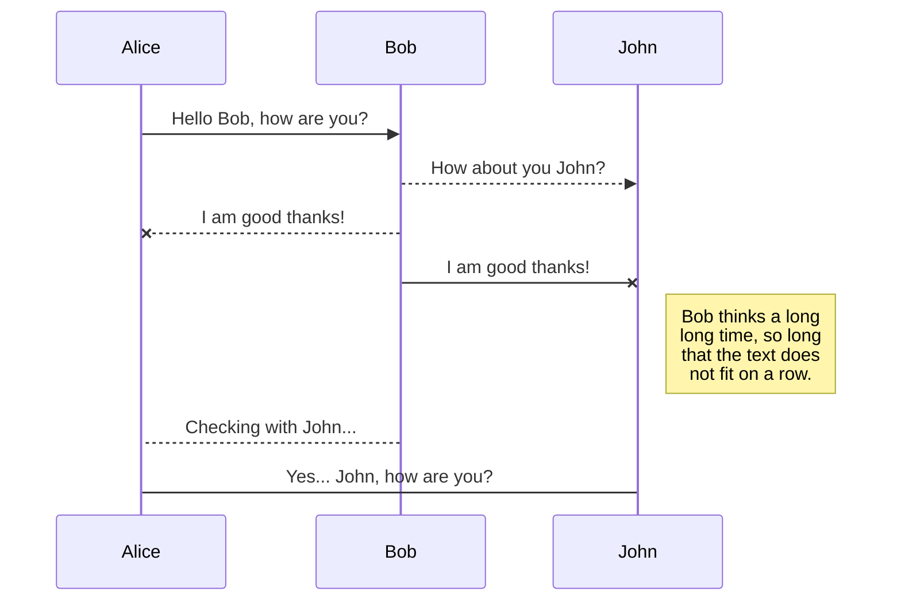
```mermaid
sequenceDiagram
    Alice ->> Bob: Hello Bob, how are you?
    Bob-->>John: How about you John?
    Bob--x Alice: I am good thanks!
    Bob-x John: I am good thanks!
    Note right of John: Bob thinks a long<br/>long time, so long<br/>that the text does<br/>not fit on a row.

    Bob-->Alice: Checking with John...
    Alice->John: Yes... John, how are you?


```

## Class Diagram

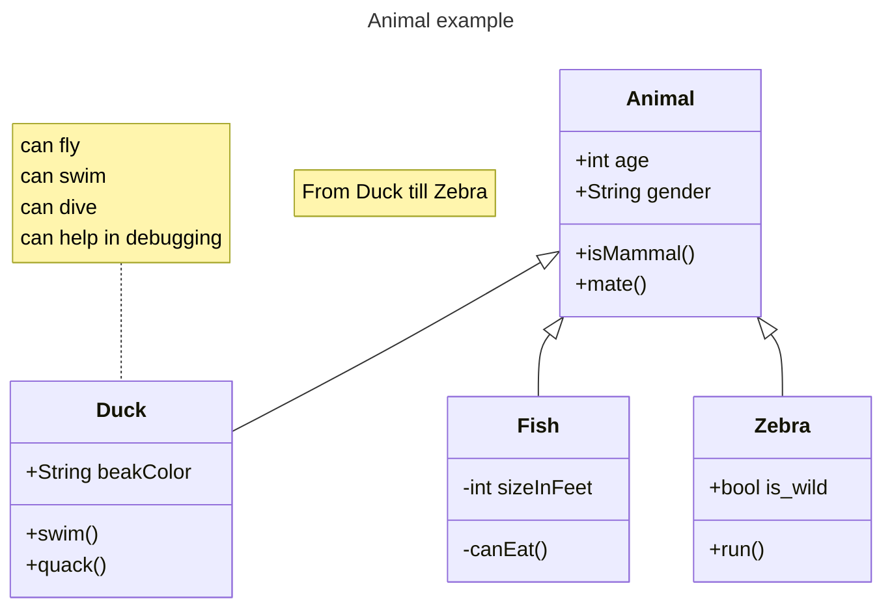
```mermaid
---
title: Animal example
---
classDiagram
    note "From Duck till Zebra"
    Animal <|-- Duck
    note for Duck "can fly<br>can swim<br>can dive<br>can help in debugging"
    Animal <|-- Fish
    Animal <|-- Zebra
    Animal : +int age
    Animal : +String gender
    Animal: +isMammal()
    Animal: +mate()
    class Duck{
        +String beakColor
        +swim()
        +quack()
    }
    class Fish{
        -int sizeInFeet
        -canEat()
    }
    class Zebra{
        +bool is_wild
        +run()
    }

```

## State Diagram

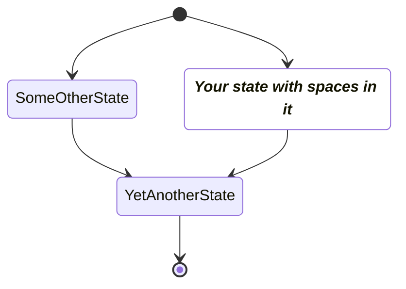
```mermaid
stateDiagram
    classDef yourState font-style:italic,font-weight:bold,fill:white

    yswsii: Your state with spaces in it
    [*] --> yswsii:::yourState
    [*] --> SomeOtherState
    SomeOtherState --> YetAnotherState
    yswsii --> YetAnotherState
    YetAnotherState --> [*]

```

## Entity Relationship Diagram

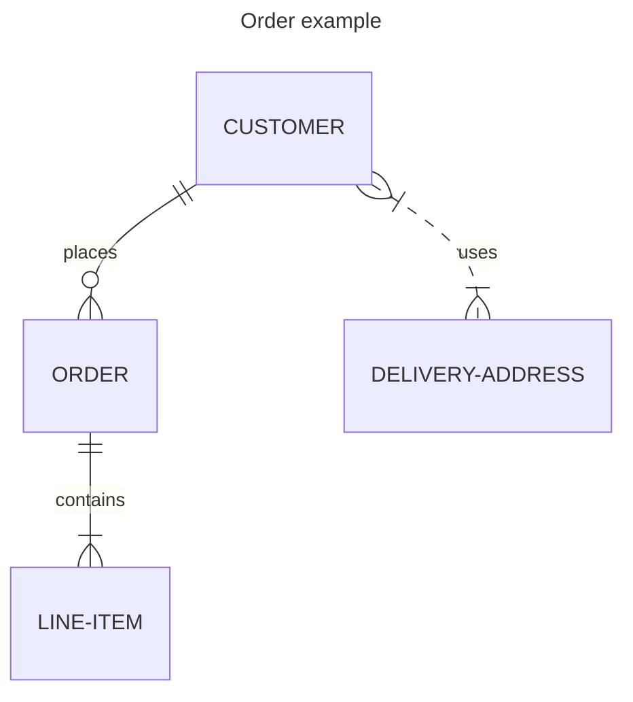
```mermaid
---
title: Order example
---
erDiagram
    CUSTOMER ||--o{ ORDER : places
    ORDER ||--|{ LINE-ITEM : contains
    CUSTOMER }|..|{ DELIVERY-ADDRESS : uses

```

## User Journey

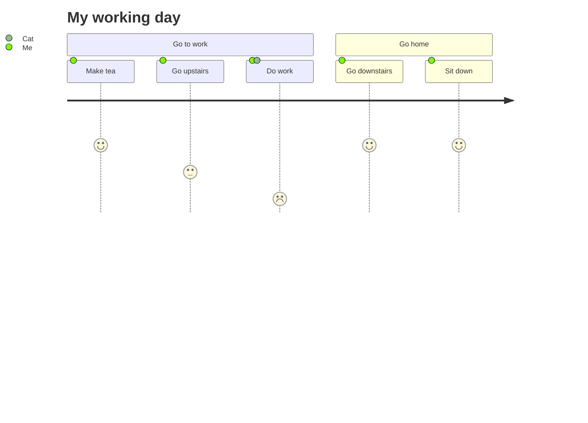
```mermaid
journey
    title My working day
    section Go to work
      Make tea: 5: Me
      Go upstairs: 3: Me
      Do work: 1: Me, Cat
    section Go home
      Go downstairs: 5: Me
      Sit down: 5: Me

```

## Gantt

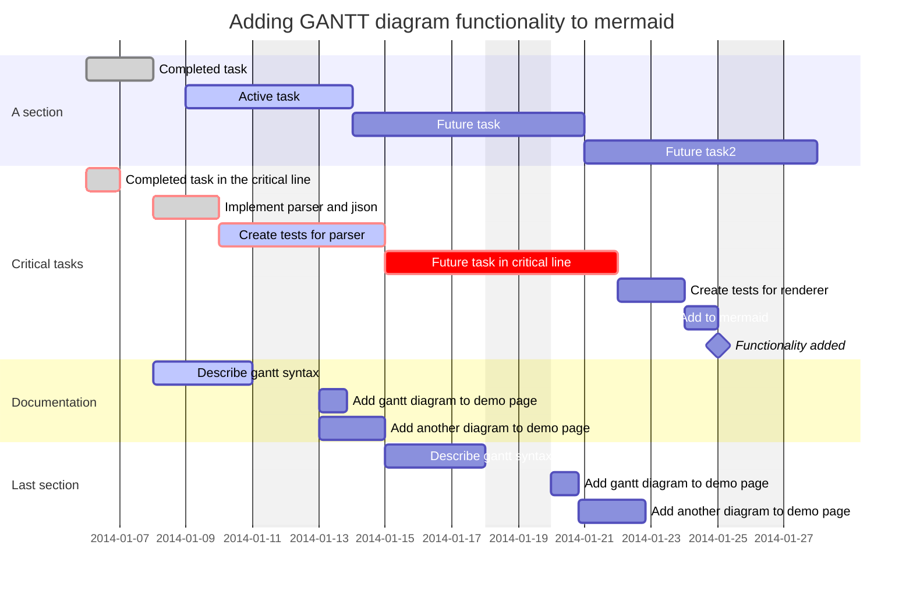
```mermaid
gantt
    dateFormat  YYYY-MM-DD
    title       Adding GANTT diagram functionality to mermaid
    excludes    weekends
    %% (`excludes` accepts specific dates in YYYY-MM-DD format, days of the week ("sunday") or "weekends", but not the word "weekdays".)

    section A section
    Completed task            :done,    des1, 2014-01-06,2014-01-08
    Active task               :active,  des2, 2014-01-09, 3d
    Future task               :         des3, after des2, 5d
    Future task2              :         des4, after des3, 5d

    section Critical tasks
    Completed task in the critical line :crit, done, 2014-01-06,24h
    Implement parser and jison          :crit, done, after des1, 2d
    Create tests for parser             :crit, active, 3d
    Future task in critical line        :crit, 5d
    Create tests for renderer           :2d
    Add to mermaid                      :until isadded
    Functionality added                 :milestone, isadded, 2014-01-25, 0d

    section Documentation
    Describe gantt syntax               :active, a1, after des1, 3d
    Add gantt diagram to demo page      :after a1  , 20h
    Add another diagram to demo page    :doc1, after a1  , 48h

    section Last section
    Describe gantt syntax               :after doc1, 3d
    Add gantt diagram to demo page      :20h
    Add another diagram to demo page    :48h


```

## Pie Chart

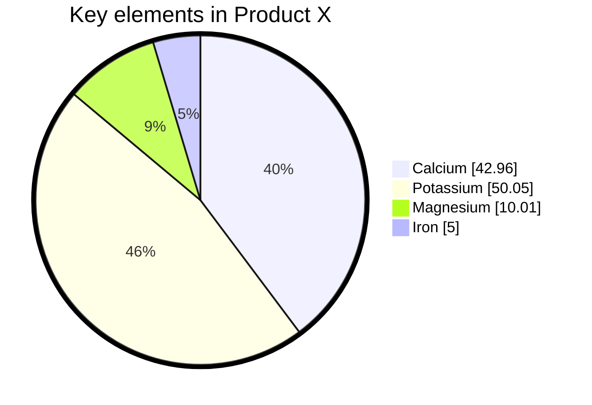
```mermaid
---
config:
  pie:
    textPosition: 0.5
  themeVariables:
    pieOuterStrokeWidth: "5px"
---
pie showData
    title Key elements in Product X
    "Calcium" : 42.96
    "Potassium" : 50.05
    "Magnesium" : 10.01
    "Iron" :  5


```

## Quadrant Chart

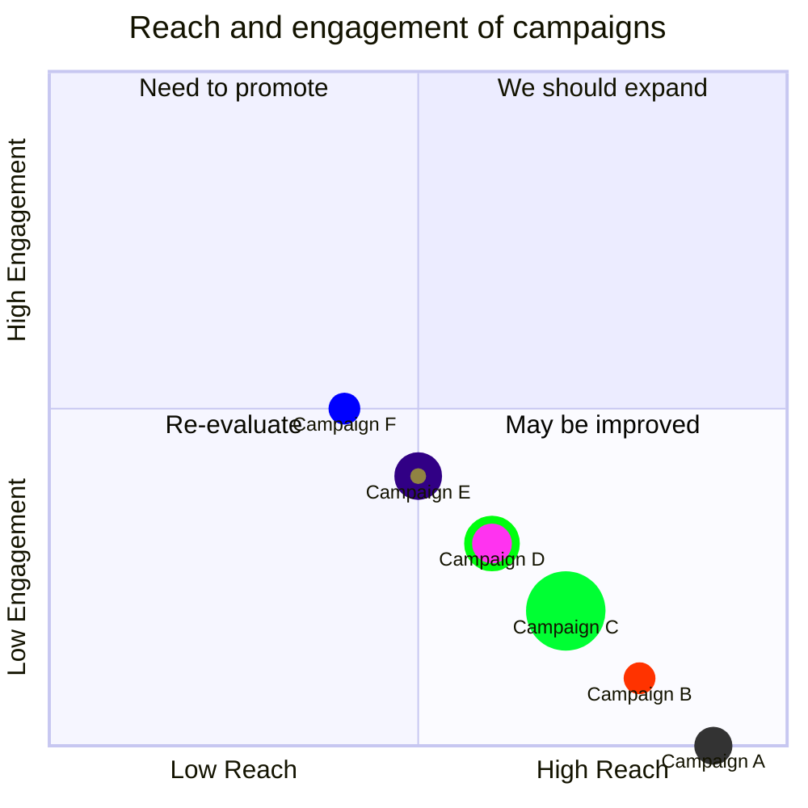
```mermaid
quadrantChart
  title Reach and engagement of campaigns
  x-axis Low Reach --> High Reach
  y-axis Low Engagement --> High Engagement
  quadrant-1 We should expand
  quadrant-2 Need to promote
  quadrant-3 Re-evaluate
  quadrant-4 May be improved
  Campaign A: [0.9, 0.0] radius: 12
  Campaign B:::class1: [0.8, 0.1] color: #ff3300, radius: 10
  Campaign C: [0.7, 0.2] radius: 25, color: #00ff33, stroke-color: #10f0f0
  Campaign D: [0.6, 0.3] radius: 15, stroke-color: #00ff0f, stroke-width: 5px ,color: #ff33f0
  Campaign E:::class2: [0.5, 0.4]
  Campaign F:::class3: [0.4, 0.5] color: #0000ff
  classDef class1 color: #109060
  classDef class2 color: #908342, radius : 10, stroke-color: #310085, stroke-width: 10px
  classDef class3 color: #f00fff, radius : 10


```

## Requirement Diagram

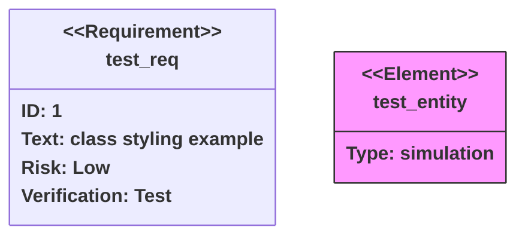
```mermaid
requirementDiagram

requirement test_req:::important {
    id: 1
    text: "class styling example"
    risk: low
    verifymethod: test
}

element test_entity {
    type: simulation
}

classDef important font-weight:bold

class test_entity important
style test_entity fill:#f9f,stroke:#333


```

## GitGraph (Git) Diagram

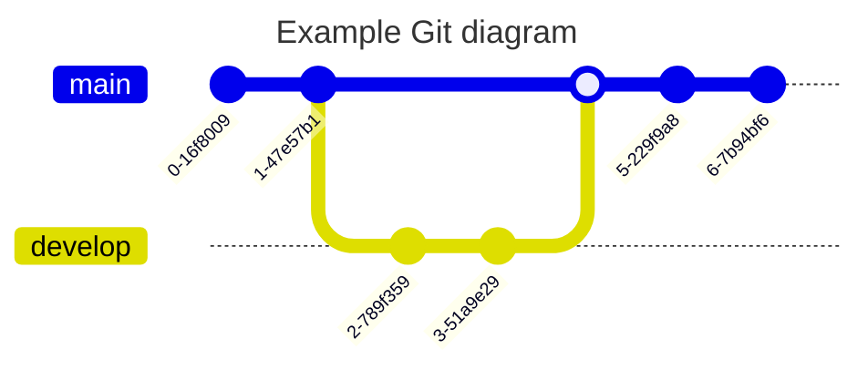
```mermaid
---
title: Example Git diagram
---
gitGraph
   commit
   commit
   branch develop
   checkout develop
   commit
   commit
   checkout main
   merge develop
   commit
   commit

```

## C4 Diagram

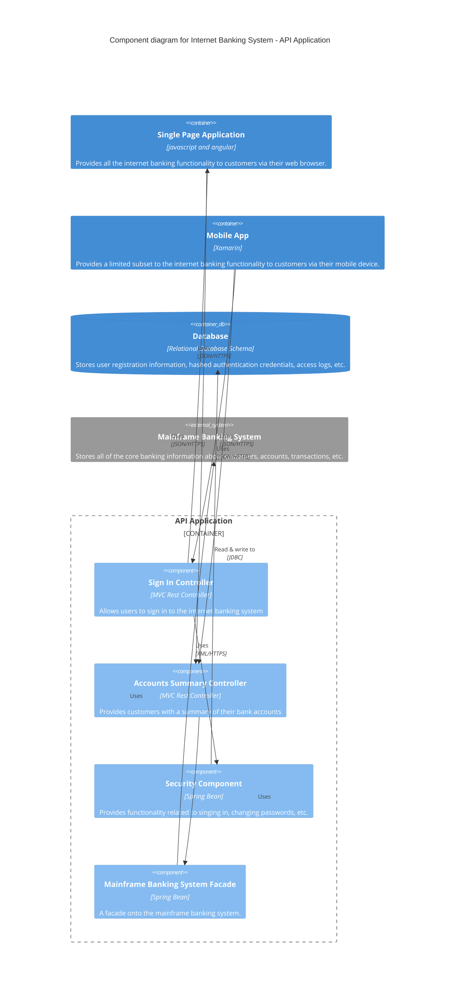
```mermaid
    C4Component
    title Component diagram for Internet Banking System - API Application

    Container(spa, "Single Page Application", "javascript and angular", "Provides all the internet banking functionality to customers via their web browser.")
    Container(ma, "Mobile App", "Xamarin", "Provides a limited subset to the internet banking functionality to customers via their mobile device.")
    ContainerDb(db, "Database", "Relational Database Schema", "Stores user registration information, hashed authentication credentials, access logs, etc.")
    System_Ext(mbs, "Mainframe Banking System", "Stores all of the core banking information about customers, accounts, transactions, etc.")

    Container_Boundary(api, "API Application") {
        Component(sign, "Sign In Controller", "MVC Rest Controller", "Allows users to sign in to the internet banking system")
        Component(accounts, "Accounts Summary Controller", "MVC Rest Controller", "Provides customers with a summary of their bank accounts")
        Component(security, "Security Component", "Spring Bean", "Provides functionality related to singing in, changing passwords, etc.")
        Component(mbsfacade, "Mainframe Banking System Facade", "Spring Bean", "A facade onto the mainframe banking system.")

        Rel(sign, security, "Uses")
        Rel(accounts, mbsfacade, "Uses")
        Rel(security, db, "Read & write to", "JDBC")
        Rel(mbsfacade, mbs, "Uses", "XML/HTTPS")
    }

    Rel_Back(spa, sign, "Uses", "JSON/HTTPS")
    Rel(spa, accounts, "Uses", "JSON/HTTPS")

    Rel(ma, sign, "Uses", "JSON/HTTPS")
    Rel(ma, accounts, "Uses", "JSON/HTTPS")

    UpdateRelStyle(spa, sign, $offsetY="-40")
    UpdateRelStyle(spa, accounts, $offsetX="40", $offsetY="40")

    UpdateRelStyle(ma, sign, $offsetX="-90", $offsetY="40")
    UpdateRelStyle(ma, accounts, $offsetY="-40")

        UpdateRelStyle(sign, security, $offsetX="-160", $offsetY="10")
        UpdateRelStyle(accounts, mbsfacade, $offsetX="140", $offsetY="10")
        UpdateRelStyle(security, db, $offsetY="-40")
        UpdateRelStyle(mbsfacade, mbs, $offsetY="-40")


```

## Mindmaps

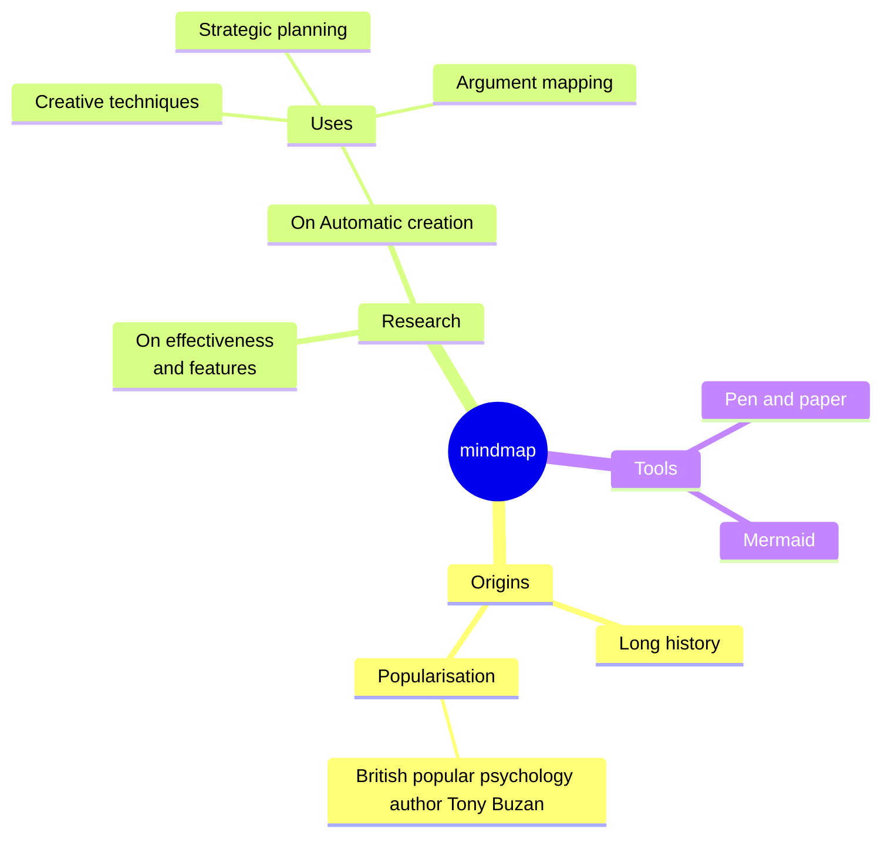
```mermaid
mindmap
  root((mindmap))
    Origins
      Long history
      ::icon(fa fa-book)
      Popularisation
        British popular psychology author Tony Buzan
    Research
      On effectiveness<br/>and features
      On Automatic creation
        Uses
            Creative techniques
            Strategic planning
            Argument mapping
    Tools
      Pen and paper
      Mermaid


```

## Timeline

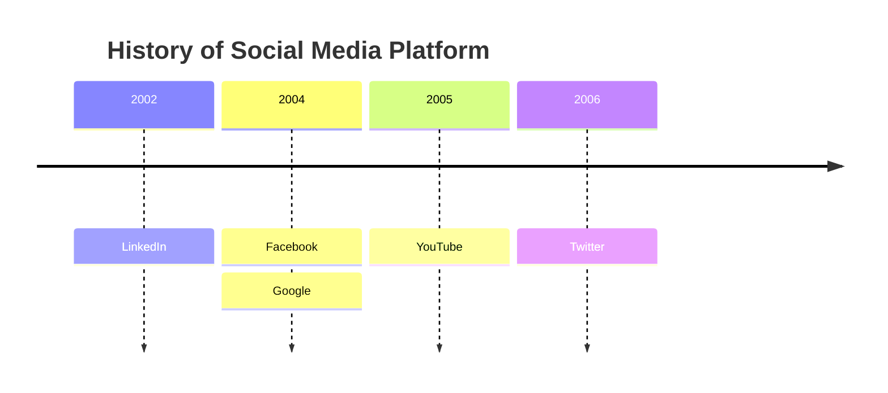
```mermaid
timeline
    title History of Social Media Platform
    2002 : LinkedIn
    2004 : Facebook
         : Google
    2005 : YouTube
    2006 : Twitter

```

## ZenUML

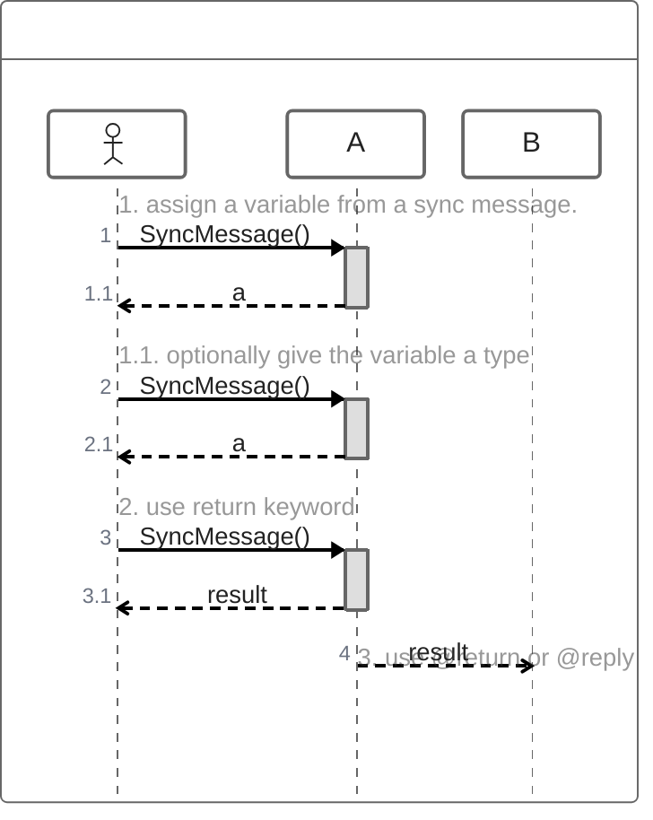
```mermaid
zenuml
    // 1. assign a variable from a sync message.
    a = A.SyncMessage()

    // 1.1. optionally give the variable a type
    SomeType a = A.SyncMessage()

    // 2. use return keyword
    A.SyncMessage() {
    return result
    }

    // 3. use @return or @reply annotator on an async message
    @return
    A->B: result


```

## Sankey

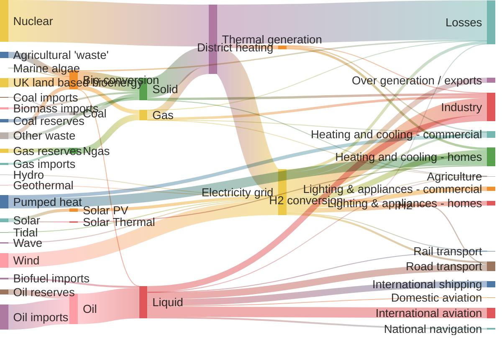
```mermaid
---
config:
  sankey:
    showValues: false
---
sankey

Agricultural 'waste',Bio-conversion,124.729
Bio-conversion,Liquid,0.597
Bio-conversion,Losses,26.862
Bio-conversion,Solid,280.322
Bio-conversion,Gas,81.144
Biofuel imports,Liquid,35
Biomass imports,Solid,35
Coal imports,Coal,11.606
Coal reserves,Coal,63.965
Coal,Solid,75.571
District heating,Industry,10.639
District heating,Heating and cooling - commercial,22.505
District heating,Heating and cooling - homes,46.184
Electricity grid,Over generation / exports,104.453
Electricity grid,Heating and cooling - homes,113.726
Electricity grid,H2 conversion,27.14
Electricity grid,Industry,342.165
Electricity grid,Road transport,37.797
Electricity grid,Agriculture,4.412
Electricity grid,Heating and cooling - commercial,40.858
Electricity grid,Losses,56.691
Electricity grid,Rail transport,7.863
Electricity grid,Lighting & appliances - commercial,90.008
Electricity grid,Lighting & appliances - homes,93.494
Gas imports,Ngas,40.719
Gas reserves,Ngas,82.233
Gas,Heating and cooling - commercial,0.129
Gas,Losses,1.401
Gas,Thermal generation,151.891
Gas,Agriculture,2.096
Gas,Industry,48.58
Geothermal,Electricity grid,7.013
H2 conversion,H2,20.897
H2 conversion,Losses,6.242
H2,Road transport,20.897
Hydro,Electricity grid,6.995
Liquid,Industry,121.066
Liquid,International shipping,128.69
Liquid,Road transport,135.835
Liquid,Domestic aviation,14.458
Liquid,International aviation,206.267
Liquid,Agriculture,3.64
Liquid,National navigation,33.218
Liquid,Rail transport,4.413
Marine algae,Bio-conversion,4.375
Ngas,Gas,122.952
Nuclear,Thermal generation,839.978
Oil imports,Oil,504.287
Oil reserves,Oil,107.703
Oil,Liquid,611.99
Other waste,Solid,56.587
Other waste,Bio-conversion,77.81
Pumped heat,Heating and cooling - homes,193.026
Pumped heat,Heating and cooling - commercial,70.672
Solar PV,Electricity grid,59.901
Solar Thermal,Heating and cooling - homes,19.263
Solar,Solar Thermal,19.263
Solar,Solar PV,59.901
Solid,Agriculture,0.882
Solid,Thermal generation,400.12
Solid,Industry,46.477
Thermal generation,Electricity grid,525.531
Thermal generation,Losses,787.129
Thermal generation,District heating,79.329
Tidal,Electricity grid,9.452
UK land based bioenergy,Bio-conversion,182.01
Wave,Electricity grid,19.013
Wind,Electricity grid,289.366

```

## XY Chart

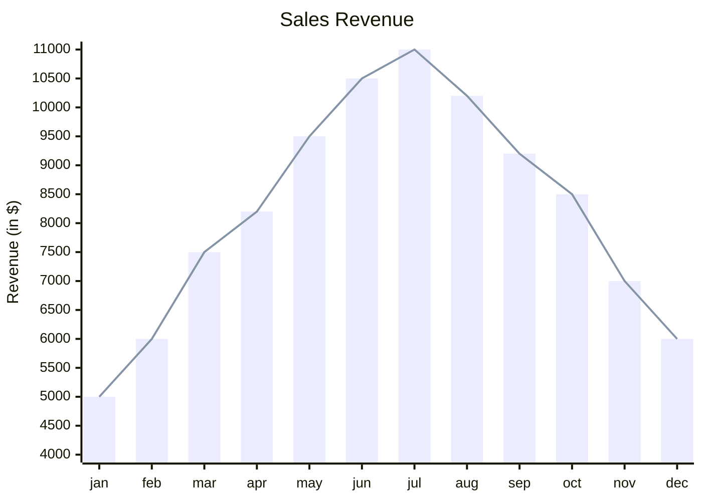
```mermaid
xychart
    title "Sales Revenue"
    x-axis [jan, feb, mar, apr, may, jun, jul, aug, sep, oct, nov, dec]
    y-axis "Revenue (in $)" 4000 --> 11000
    bar [5000, 6000, 7500, 8200, 9500, 10500, 11000, 10200, 9200, 8500, 7000, 6000]
    line [5000, 6000, 7500, 8200, 9500, 10500, 11000, 10200, 9200, 8500, 7000, 6000]

```

## Block Diagram

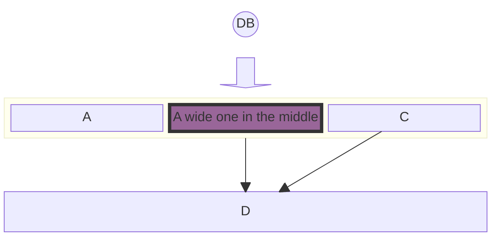
```mermaid
block
columns 1
  db(("DB"))
  blockArrowId6<["&nbsp;&nbsp;&nbsp;"]>(down)
  block:ID
    A
    B["A wide one in the middle"]
    C
  end
  space
  D
  ID --> D
  C --> D
  style B fill:#969,stroke:#333,stroke-width:4px

```

## Packet

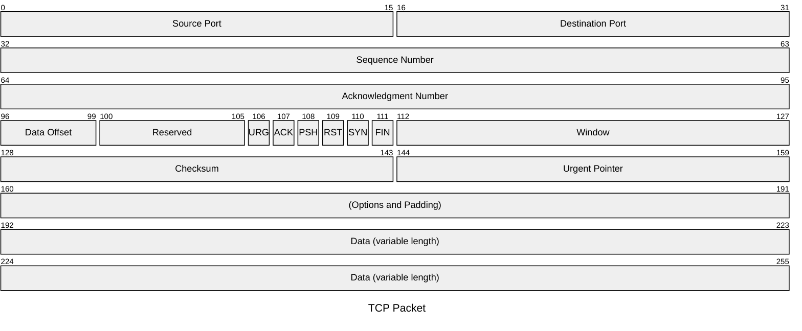
```mermaid
---
title: "TCP Packet"
---
packet
0-15: "Source Port"
16-31: "Destination Port"
32-63: "Sequence Number"
64-95: "Acknowledgment Number"
96-99: "Data Offset"
100-105: "Reserved"
106: "URG"
107: "ACK"
108: "PSH"
109: "RST"
110: "SYN"
111: "FIN"
112-127: "Window"
128-143: "Checksum"
144-159: "Urgent Pointer"
160-191: "(Options and Padding)"
192-255: "Data (variable length)"

```

## Kanban

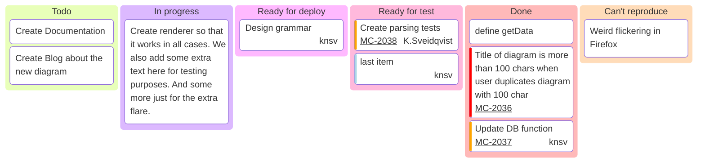
```mermaid
---
config:
  kanban:
    ticketBaseUrl: 'https://mermaidchart.atlassian.net/browse/#TICKET#'
---
kanban
  Todo
    [Create Documentation]
    docs[Create Blog about the new diagram]
  [In progress]
    id6[Create renderer so that it works in all cases. We also add some extra text here for testing purposes. And some more just for the extra flare.]
  id9[Ready for deploy]
    id8[Design grammar]@{ assigned: 'knsv' }
  id10[Ready for test]
    id4[Create parsing tests]@{ ticket: MC-2038, assigned: 'K.Sveidqvist', priority: 'High' }
    id66[last item]@{ priority: 'Very Low', assigned: 'knsv' }
  id11[Done]
    id5[define getData]
    id2[Title of diagram is more than 100 chars when user duplicates diagram with 100 char]@{ ticket: MC-2036, priority: 'Very High'}
    id3[Update DB function]@{ ticket: MC-2037, assigned: knsv, priority: 'High' }

  id12[Can't reproduce]
    id3[Weird flickering in Firefox]


```

## Architecture

```mermaid
architecture-beta
    group api(cloud)[API]

    service db(database)[Database] in api
    service disk1(disk)[Storage] in api
    service disk2(disk)[Storage] in api
    service server(server)[Server] in api

    db:L -- R:server
    disk1:T -- B:server
    disk2:T -- B:db


```

## 

```mermaid
architecture-beta
    group api(logos:aws-lambda)[API]

    service db(logos:aws-aurora)[Database] in api
    service disk1(logos:aws-glacier)[Storage] in api
    service disk2(logos:aws-s3)[Storage] in api
    service server(logos:aws-ec2)[Server] in api

    db:L -- R:server
    disk1:T -- B:server
    disk2:T -- B:db

```

## Radar

```mermaid
radar-beta
axis A, B, C, D, E
curve c1{1,2,3,4,5}
curve c2{5,4,3,2,1}
... More Fields ...
```

## Treemap

```mermaid
treemap-beta
"Category A"
    "Item A1": 10
    "Item A2": 20
"Category B"
    "Item B1": 15
    "Item B2": 25
```

## Venn

```mermaid
venn-beta
  title "Team overlap"
  set Frontend
  set Backend
  union Frontend,Backend["APIs"]

```

## Ishikawa

```mermaid
ishikawa-beta
    Blurry Photo
    Process
        Out of focus
        Shutter speed too slow
        Protective film not removed
        Beautification filter applied
    User
        Shaky hands
    Equipment
        LENS
            Inappropriate lens
            Damaged lens
            Dirty lens
        SENSOR
            Damaged sensor
            Dirty sensor
    Environment
        Subject moved too quickly
        Too dark

```

## TreeView

```mermaid
treeView-beta
    "packages"
        "mermaid"
            "src"
        "parser"

```

